> This is the project report compiled by Sajid Anwar and Tanmay Binaykiya as part of the course requirements of [CS 6491 Computer Graphics](https://www.cc.gatech.edu/~jarek/6491/) under [Prof. Jaroslav Rossignac](https://www.cc.gatech.edu/~jarek/)

# Abstract

The project aims to compute a tetrahedronalization from balls on a floor and on a ceiling, to create a mesh that is comprised of cylinders and spheres corresponding to the edges and vertices of the tetrahedra, and finally computing a water tight approximation of the boundary of those cylinders and spheres given a point cloud. The tetrahedronalization is computed using Delaunay triangulation extended to three dimensions. We generate the mesh we want to approximate by creating spheres at the vertices and cylinders at the edges of all of the tetrahedra that were computed. Points are sampled on all of the spheres and cylinders to obtain the point cloud, and finally ball pivoting is used to reconstruct the surface of our mesh using the point cloud.

<center><iframe width="1280" height="720" src="https://www.youtube.com/embed/bC1mUjPqBsM?rel=0" frameborder="0" gesture="media" allow="encrypted-media" allowfullscreen></iframe></center>

# Approach

## Bottom Up Approach

* To compute a water tight mesh, we need a point cloud which is usually obtained by 3-dimensional scans of real world objects.
* To simplify this step, we simulate a point cloud by creating objects in the scene and sampling points on them.
* The scene that we generate needs to be complex enough, that there are multiple objects intersecting. We choose the sampling of spheres and cylinders for the same.
* The scene is built as a truss structure formed by spheres segregated in 2 layers(floor and ceiling) and cylinders connecting them. To make it more realistic, we use a DeLaunay tetrahedralization to connect the points between the floor and the ceiling.

# Delaunay Triangulation

A Delaunay triangulation for a given set P of discrete points in a plane is a triangulation DT(P) such that no point in P is inside the circumcircle of any triangle in DT(P).

| 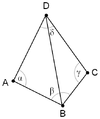|  | 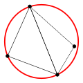 |

**Figure 1**.
a) This triangulation does not meet the Delaunay condition (the sum of α and γ is bigger than 180°)
b) This pair of triangles does not meet the Delaunay condition (the circumcircle contains more than three points)
c) Flipping the common edge produces a valid Delaunay triangulation for the four points

## Algorithm to compute the Delaunay triangulation of set P

```
for each triplet of points (A, B, C) in P, find the circumcircle (center Q, radius r)
    for point D in P that is not A, B or C
        if d(D, Q) &lt; r
            # we have found a point that is inside the circumcircle of (A, B, C).
            # Hence (A, B, C) cannot be in the DT(P)
            fail = true
            break
    if fail == true
        continue
    else
        add (A, B, C) to DT(P)
```        

# Delaunay Tetrahedralization

A Tetrahedron is a polyhedron composed of four triangular faces, six straight edges, and four vertex corners.

Given a set of points in R3, find a tetrahedralization DTH(P) such that no other point lies in the circumsphere of each of the tetrahedrons.

Figure 3.1 below illustrates these representations in a visual form. Each of the control points are shown with their label. The scalar radii are represented by edges between control points (radius of circle AB is represented by the diameter AB). The arcs are visualized in color as per the diagram below.

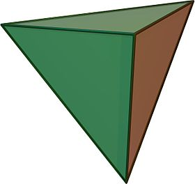

**Figure 4** Tetrahedron

## Algorithm

## Naïve Approach: O(N<sup>5</sup>)

```
for each quadruplet of points (A, B, C, D) in P, 
    find the circumsphere(Center Q, radius r) 
    for point E in P that is not A, B, C or D
        if d(E, Q) < r
        # we have found a point that is inside the circumsphere of (A, B, C, D). Hence (A, B, C, D) cannot be in the DTH(P)
        fail = true
        break
    if fail == true
        continue
    else
        add (A,B,C,D) to DTH(P) 
```

## A more efficient approach O(N<sup>4</sup>)

We use the concept of a bulge to find D (on the ceiling). Given that the planes are parallel, we can assume that the circumsphere&#39;s center lies on normal of the floor through the circumcenter of the circumcircle of Triangle ABC. Also, the intersection of the circumsphere with the ceiling will result in a circle and D will lie on this circle. As all other points lie on the ceiling and no other point on the ceiling lies in the circumsphere, D should be the closest to the center of this circle.

Hence, we find the projection of the circumcenter of the circumcircle of Triangle ABC on the ceiling and find the point closest to it.

```
Perform a Delaunay Triangulation on P = DT(P)
  for each triangle ABC in P:
     find the circumcircle(center Q, radius R)
     find the intersection R of N = AB x BC through Q on the second plane 
     find the point D in the second plane that is nearest to R
```

_Further improvements can be made in this approach by rejecting points farther than a certain a certain threshold. This approximate distance should be computed without the use of square roots or the cost of the optimization is higher than the advantage. This can be done by a rectangular comparison(using square as an approximation of the circle to facilitate computing)_

# Tetrahedralization Results

The following are illustrations of the Delaunay Triangulation of the ceiling and floor.

<table>
  <tbody>
    <tr>
      <td>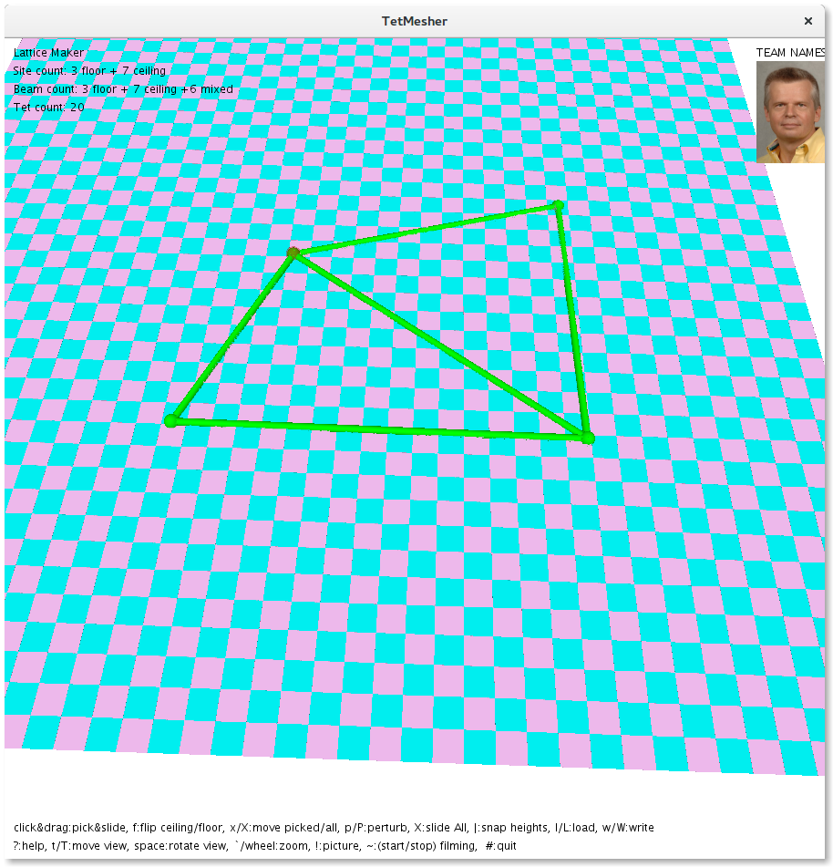</td>
      <td></td>
      <td>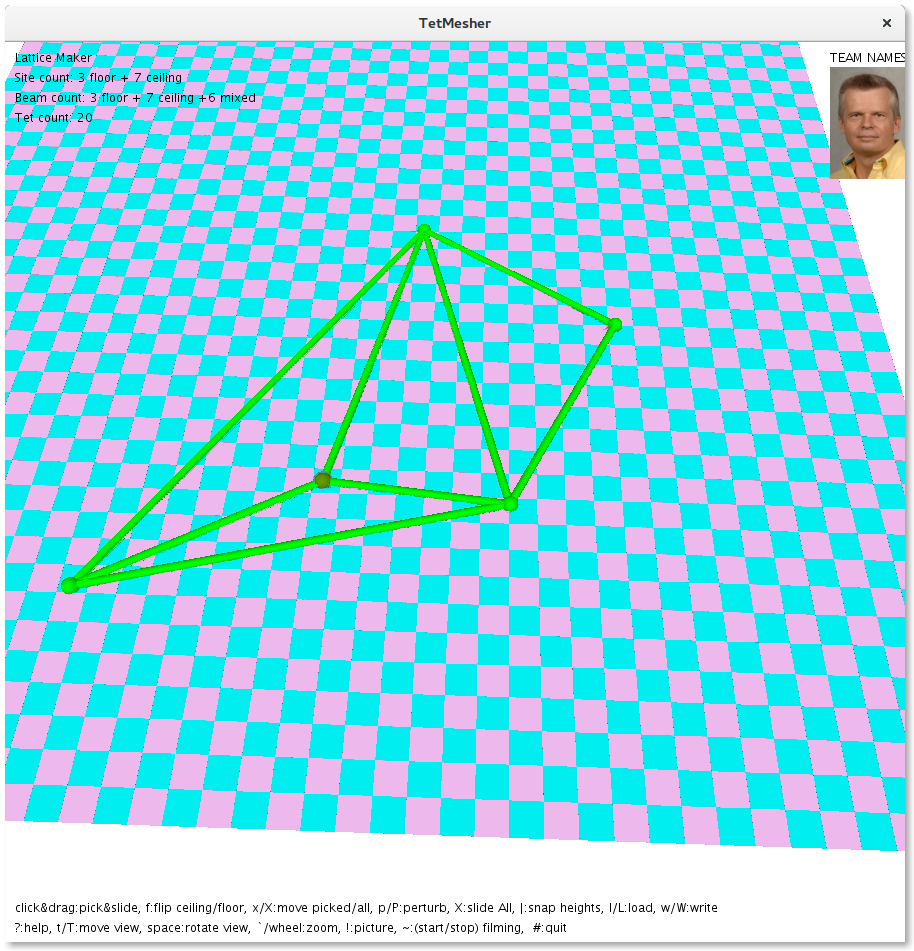</td>
    </tr>
    <tr>
      <td></td>
      <td>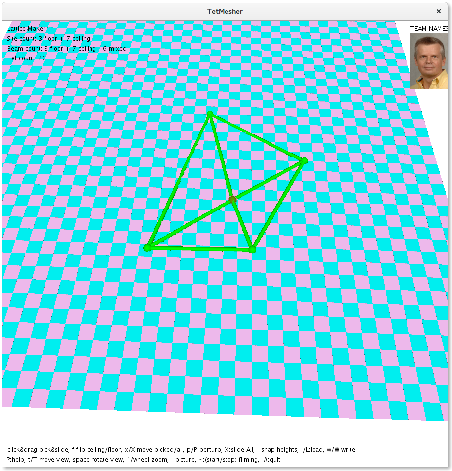</td>
      <td>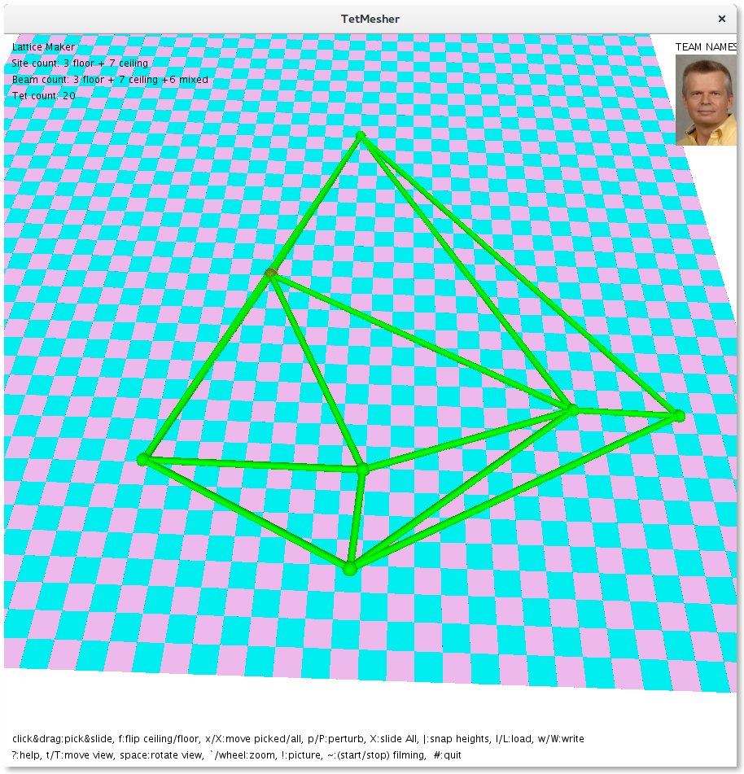</td>
    </tr>
    <tr>
      <td></td>
      <td></td>
    </tr>
  </tbody>
</table>

# Tetrahedralization

The tetrahedralization progress is documented as illustrated in the screenshots below:

The current process is that we do a tetrahedralization of the floor and the ceiling separately and draw all the edges. This causes edges to be repeated. We mitigate this drawback by collecting all edges in a set to avoid repetitions.

<table >
  <tbody>
    <tr>
        <td></td>
        <td></td>
        <td></td>
    </tr>
    <tr>
        <td>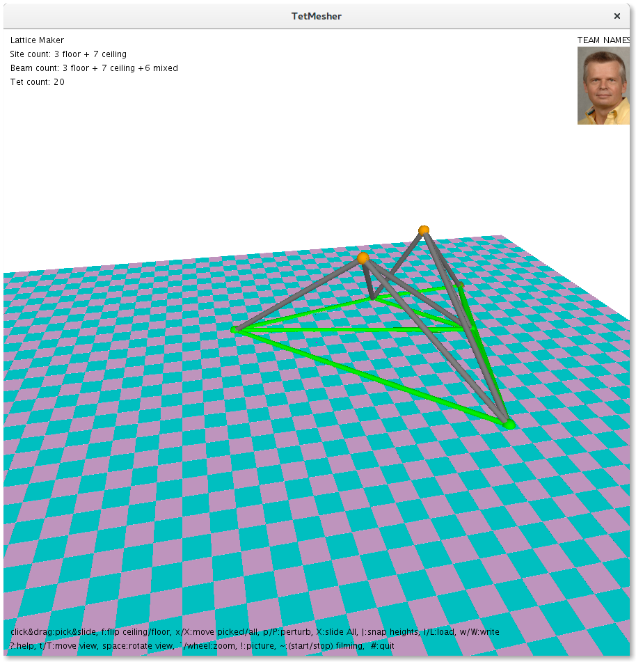</td>
        <td>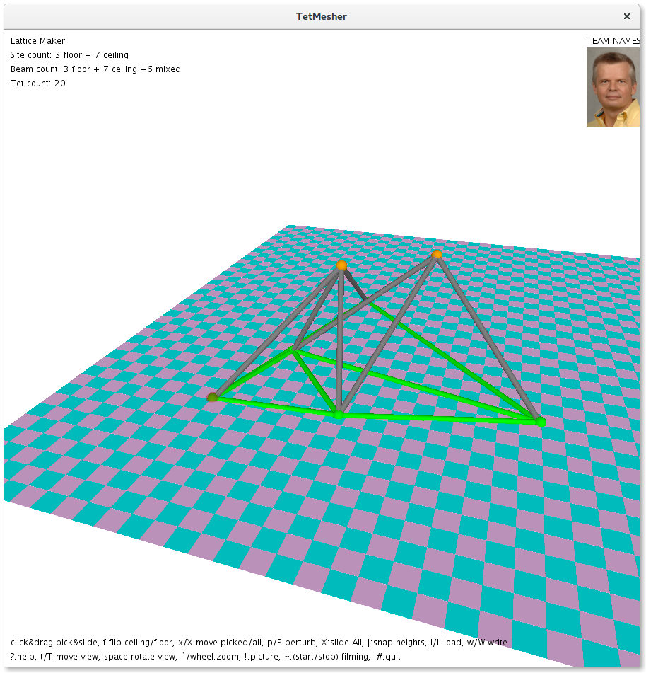</td>
        <td>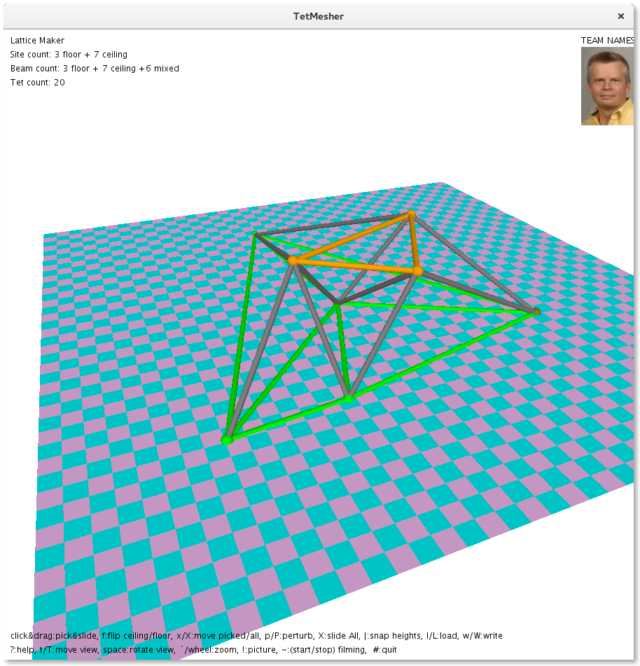</td>
    </tr>
    <tr>
        <td></td>
    </tr>
  </tbody>
</table>

# Point Cloud Generation

The Ball Pivot Algorithm typically computes a water tight mesh of a given point cloud obtained from high res scans of real world objects. To generate a point cloud, we use the tetrahedralization of the ceiling and floor points. We &quot;create&quot; cylinders to represent edges and spheres to represent the points on the celing and the floor.

For each of the cylinders and spheres we densely sample points. This collection of points serves as our point cloud.

The following diagram illustrates the point cloud hence obtained.
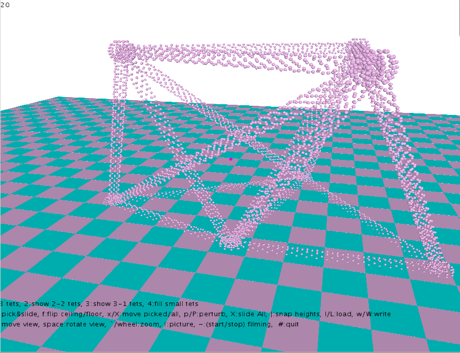

# Ball Pivoting Algorithm

The Ball-Pivoting Algorithm (BPA) provided by [1] computes a triangle mesh interpolating a given point cloud. Typically, the points are surface samples acquired with multiple range scans of an object. The principle of the BPA is very simple:

* Three points form a triangle if a ball of a user-specified radius **r** touches them without containing any other point.
* Starting with a seed triangle, the ball pivots around an edge (i.e. it revolves around the edge while keeping in contact with the edge&#39;s endpoints) until it touches another point, forming another triangle.
* The process continues until all reachable edges have been tried, and then starts from another seed triangle, until all points have been considered.

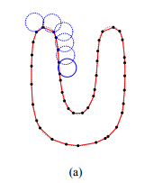

**2 dimensional representation of the Ball Pivoting algorithm**: A circle of radius **r** pivots from sample point to sample point, connecting them with edges 
_Figure courtesy of [1](#references)_ 

## Implementation Details

### Data Representation

| Point               | Triplet&lt;Float, Float, Float&gt;: representing the x, y, z coordinates of a point | 
| PointCloud          | List&lt;Point&gt; | 
| VoxelCoordinate     | Triplet&lt;Integer, Integer, Integer&gt;: representing coordinates of a voxel in the grid-based voxel space | 
| VoxelSpace          | Map&lt;VoxelCoordinate, List&lt;Point&gt;&gt;: representing a mapping between a voxel and the points contained within that voxel, which is recomputed when the point cloud changes | 
| Edge                | Pair&lt;Number Number&gt;: representing the index of vertices in the point cloud | 
| Mesh                | List&lt;List&lt;Point&gt;&gt; layers: representing the intermediate step of layers of points while computing the PointCloud. | 
| Generated Triangles | List&lt;Triplet&lt;Point, Point, Point&gt;&gt;: representing the indices of the vertices forming the triangle. | 
| Frontier            | Stack&lt;Pair&lt;Edge, Point&gt;&gt;: representing the intermediate data while computing the water tight mesh. Each pair is an edge and a point that form the triangle that the ball will pivot _from_; the edge will be what the ball will pivot _over_. | 
| Explored            | Set&lt;Edge&gt; representing the intermediate data while computing the water tight mesh. Contains the set of edges which have been pivoted about. | 
| Boundary Edges      | Set&lt;Edge&gt;: representing the intermediate data while computing the water tight mesh. Contains the set of edges which have been pivoted about and are found to be boundary edges (only 1 triangle is incident on the edge). | 

### Point Cloud Generation

#### Sampling points on a Cylinder

Points are sampled on the cylinder such that applying the BPA Algorithm of the sampled points form equilateral triangles. To sample points along a cylinder, we iterate along the length of the cylinder in fixed length increments. At each length-wise iteration, we iterate around the circular boundary of the cylinder in fixed angular increments.

By defining N as the number of points to be sampled along the circumference, the fixed angle increment ϴ  is:

    ϴ = 2π/N

The number of slices along the length of the cylinder is then given by

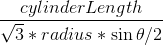

This number of slices is obtained as a ratio between the height and the side length of an equilateral triangle. Points are now sampled at each of these slices at every ϴ angle.

The diagram below shows the sampling of points along the cylinder (the sampled points form the vertices of the displayed triangles).

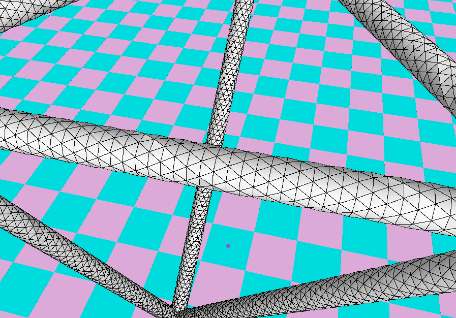

#### Sampling points on a Sphere

Similar to the sampling on the cylinders, points are sampled on the sphere in slices along a diameter of the sphere. The number of slices, N, is predetermined. For each slice, the radius of the circle is computed as

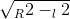

where R is the radius of sphere, and l is the distance of the slice from the center of sphere.

The angle increment ϴ is now computed as _ϴ = 2π/N_. Points are now sampled along each slice at every ϴ .

The resultant point cloud is shown below, where the vertices of the displayed triangles are the sampled points.

 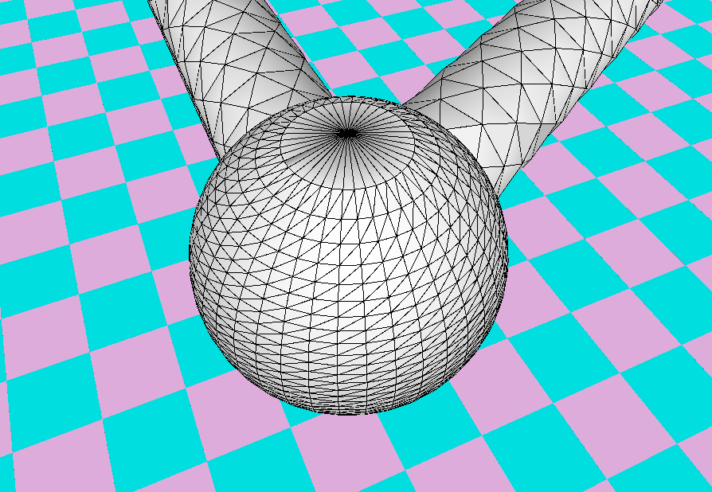

All points hence obtained are collected in _PointCloud_.

### Voxel Space

Some of the steps of the ball pivoting algorithm rely on finding the &quot;best&quot; point in a given point&#39;s neighborhood, for various definitions of &quot;best&quot;. However, before we obtain the triangles from ball pivoting, there is no connectivity data associated with the point cloud, and therefore all points in the cloud must be iterated when attempting to find the best point. We improve this naïve iteration by partitioning the space into voxels and keeping track of which points are contained within a given voxel, allowing us to quickly get the neighborhood of a point and drastically improve performance. The ball pivoting algorithm discussed in the next section will assume an implementation without the voxel space partition, in which all points must be iterated when searching. The voxel space implementation and changes to the ball pivoting algorithm to accommodate voxels is discussed in section 8.1.

### Ball Pivoting

#### Seed triangle

The seed triangle is the triangle chosen to start the ball pivoting from. The triangle should satisfy the constraint that **the pivotBall must rest on the points such that no other point lies inside this ball.**

We find this seed triangle naively by searching through all points and computing the pivot ball&#39;s center.

If any other point is at a distance less than the pivot ball&#39;s radius, it lies inside the pivot ball, and hence the triangle must be rejected.

Once we find this seed triangle, we push its three edges onto the frontier, and add it as the first triangle on our generated triangle set.

#### Ball Pivoting Algorithm

The ball pivoting algorithm is as follows. We continuously remove edge-vertex pairs from the frontier. The edge-vertex pair form the triangle that the ball will pivot from. The ball will initially rest on the three points of the edge and vertex, and will pivot over the edge.

To find the next point to pivot to given the pivot edge and vertex, we iterate over all points and select the point which is both close enough for the ball to fit on the triangle formed by the current point and the original pivot edge, and also has the smallest angle between the new ball position and the current ball position.

Each time we get a pivot edge and a vertex from the frontier:

* We add the pivot edge to the set of explored edges, to signify that it should not be re-added to the frontier in case it is reached again later on, since it will have already been pivoted over in this iteration.
* Given the pivot edge and vertex that the ball is currently resting on, find the next best vertex that the ball will pivot to. This new vertex, along with the edge that was pivoted over, is the new current triangle the ball is resting on. If no vertex is found, then this edge is added to the boundary edge set, and the iteration continues.
* Create two edges E1 and E2 corresponding to the two edges in the current triangle that are not the boundary edge. If both E1 and E2 are not in the explored set, then this current triangle has never been visited before, so it is added to the final triangle list.
* If E1 is not currently in the frontier and it has never been explored, then it, along with the opposite vertex in the triangle, is added to the frontier to be pivoted over later. A similar step is taken with E2.

The algorithm completes after there are no edges on the frontier. At this point, we have a set of triangles corresponding to the triangulation of the surface of the point cloud.

# Optimizations

## In-voxel search

The most expensive computation in the pipeline is the Ball Point Algorithm. While finding the _pivot-able vertex,_ we look at all other vertices. This is redundant as most other points are far enough that the ball can&#39;t pivot to them. We find the best vertex for pivoting by determining which vertex results in the smallest angle that the ball must pivot to reach that vertex. This operation is expensive as it involves complex mathematical functions.

We replace this approach by looking at vertices in a voxel around the pivot edge. Our voxel space is a mapping between voxel coordinates and the bucket of points that are contained within that voxel. The voxel space is initialized with a given voxel size; we use twice the radius of the ball as the size of the voxel. This choice of voxel size means that when searching for the best vertex to pivot to, the algorithm needs to check no more than the neighborhood of 27 voxels (3x3x3). Once a size for the voxel is chosen, a point P(_x, y, z_) can be mapped to its voxel coordinate V(_x, y, z_) = (⌋⌋,⌊P.z⌋,⌊P.y⌊P.x
). The voxel mapping is then constructed by iterating through each point, determining its voxel coordinate, obtaining the bucket for that coordinate, and adding the point to that bucket (if no bucket exists, an empty one is first created and added to the map at that voxel coordinate).

This implementation is space-efficient as empty voxels do not take up storage space. It is also fast since the mapping between voxel coordinates and points is a hash map, and both computing the hash of a voxel coordinate and looking up the bucket of points in a voxel are constant-time operations.

The following changes are made to the algorithm to use the voxel space optimization:

* When selecting the seed triangle, instead of checking all triplets of points, we iterate over all points and only check triangles within its voxel neighborhood.
* When selecting the next vertex to pivot to, instead of checking all points, we only check points within the neighborhood of the original vertex that we are pivoting from.

This approach improves the runtime performance considerably, enough for the computations to be done runtime (**over 15fps)**.

# Smooth shading

The mesh generated is a polygonal approximation of the smooth surface, owing to which the mesh does not look organic. We apply the technique of smooth shading to combat this problem.

By default, Processing applies a standard light source when rendering a scene. When determining how the light source interacts with the meshes in the scene, the renderer must account for the normal vectors of the primitives (e.g.: triangles).

Without smooth shading, the normal vectors of each triangle&#39;s vertices are assumed to be equivalent to the normal vector of that triangle. This results in a very faceted look, as seen in section 10.1, where each constituent triangle of the mesh is easily discernable from its neighboring triangles.

With smooth shading, the normal vectors of each vertex are approximated so as to result in a smooth-looking mesh where the triangles are not discernable. This works well because the renderer interpolates between the vertex normal vectors as it renders points on the triangle, leaving the appearance of a smooth mesh. The approximate normal vector we compute for each point is equivalent to the average of the normal vectors of all triangles incident to that point. We first associate each point in the cloud with its approximate normal vector, which is initialized to the zero vector. Every time the ball pivoting algorithm reaches a new triangle and adds it to the generated list, for each of the three vertices we compute the cross product of the vectors representing the two edges that contain that vertex and add it to the approximate normal for that point. Section 10.2 shows an example of smooth shading applied to a mesh.


# Results

## Without Smooth Vertex Shading

<table >
  <tbody>
    <tr>
        <td></td>
        <td>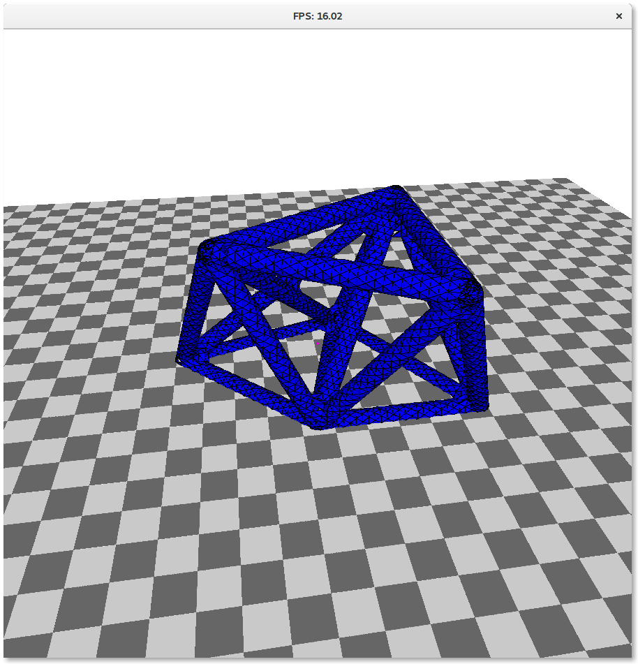</td>
        <td>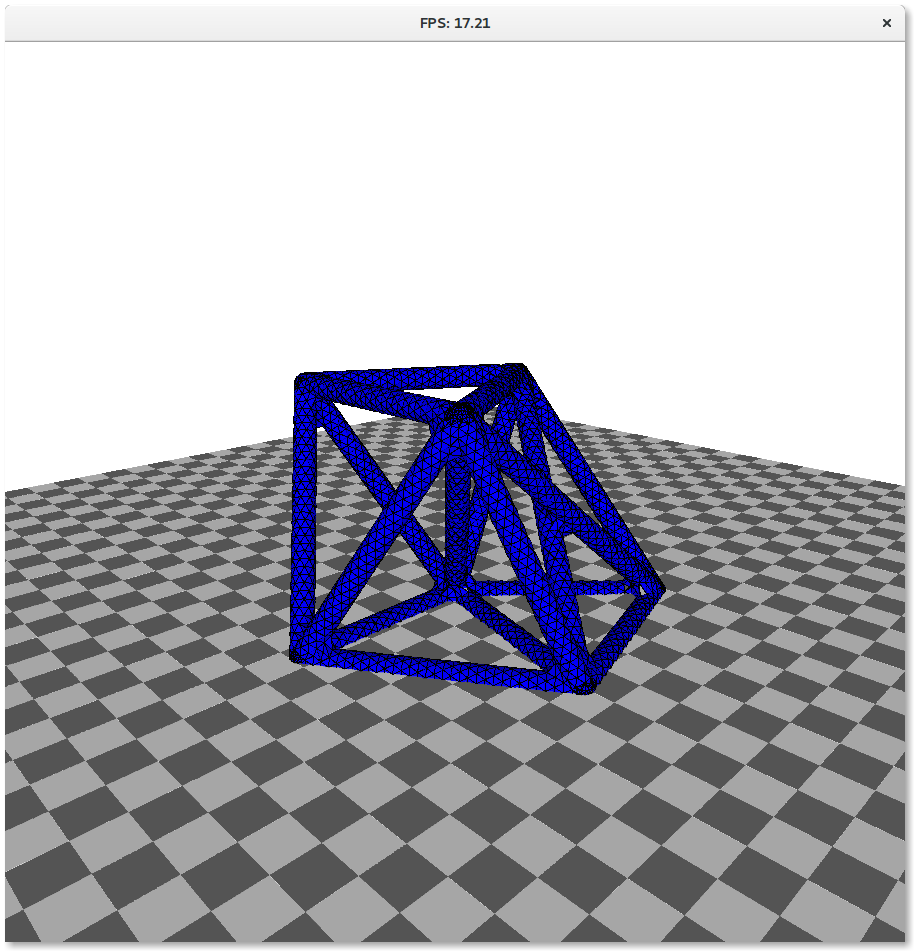</td>
        <td></td>
    </tr>
    <tr>
        <td></td>
        <td>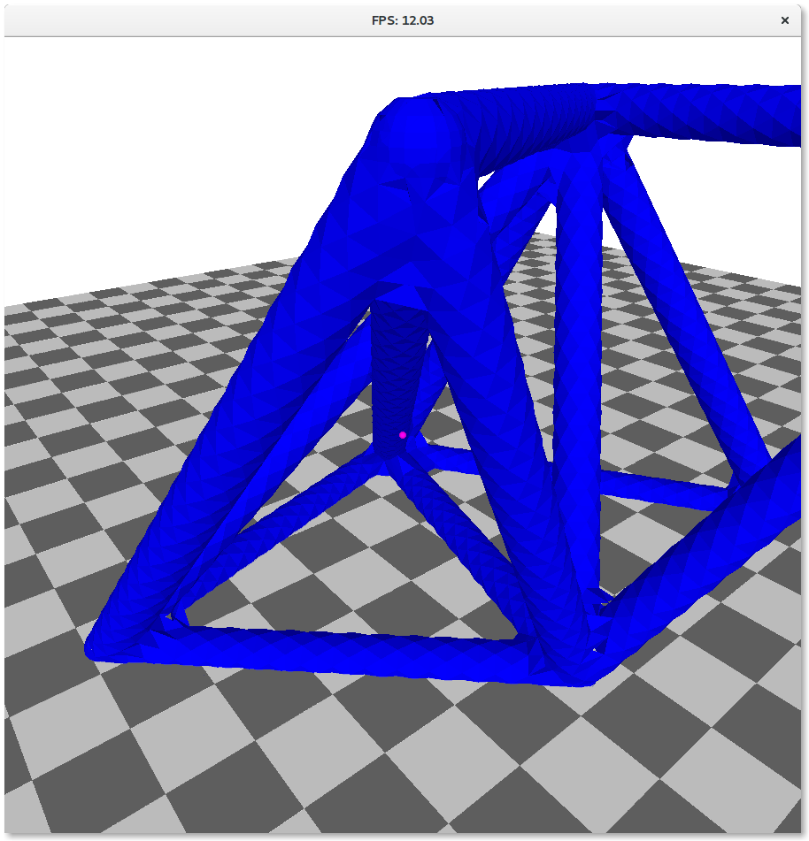</td>
        <td>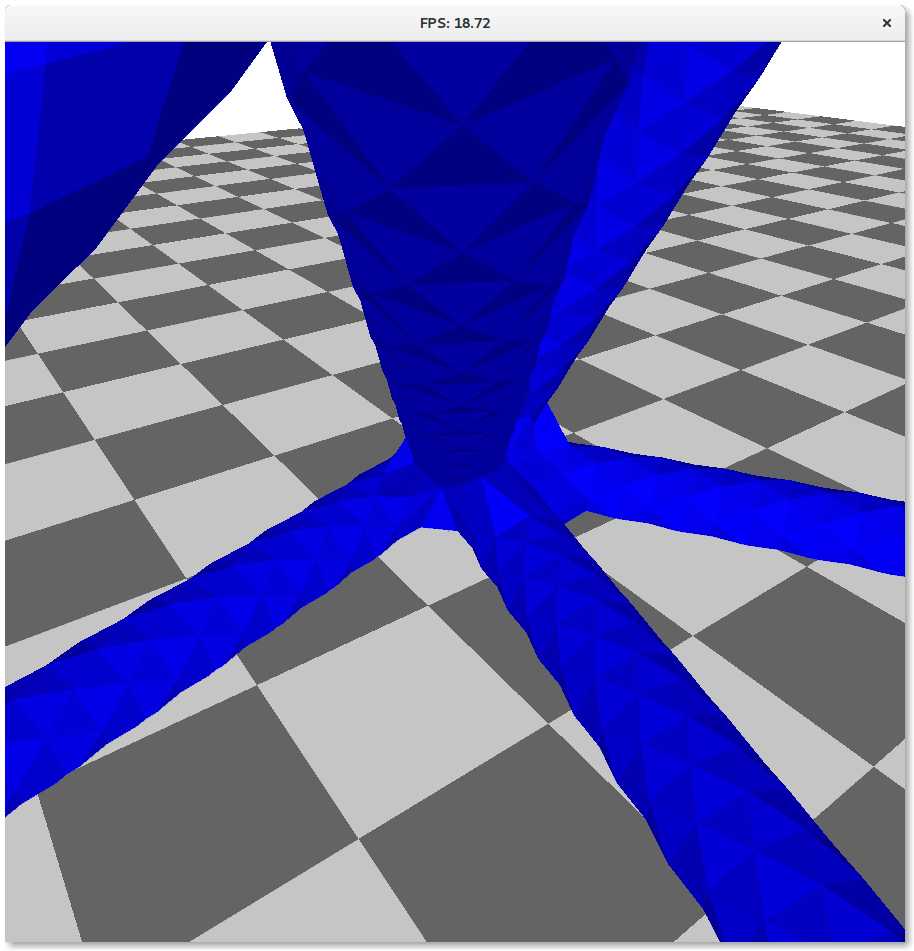</td>
        <td></td>
    </tr>
  </tbody>
</table>


## After vertex smoothing

<table>
  <tbody>
    <tr>
        <td></td>
        <td>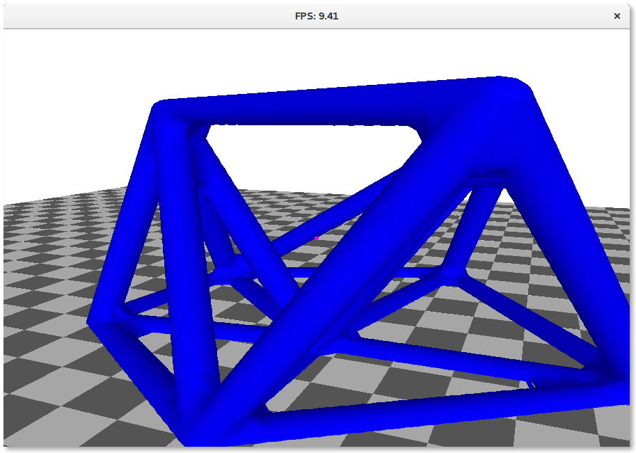</td>
        <td>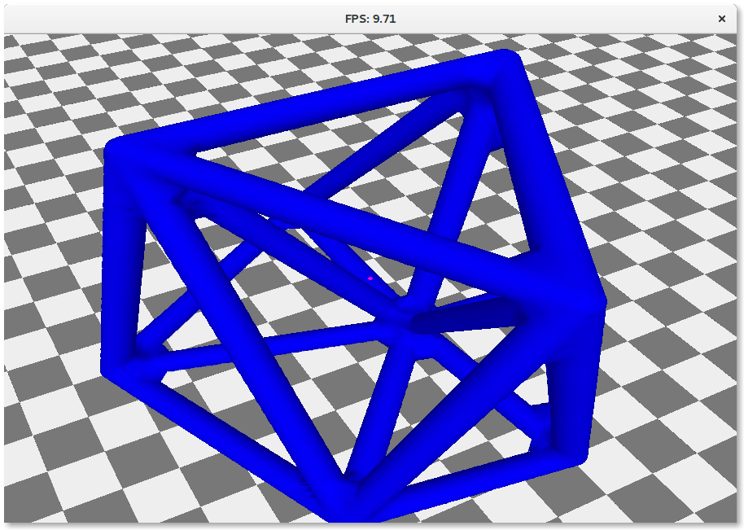</td>
        <td></td>
    </tr>
  </tbody>
</table>


# Completeness

The attached program fails to build a completely water tight mesh due to the following failures.

A few holes can be seen on the surface of the mesh.

<td>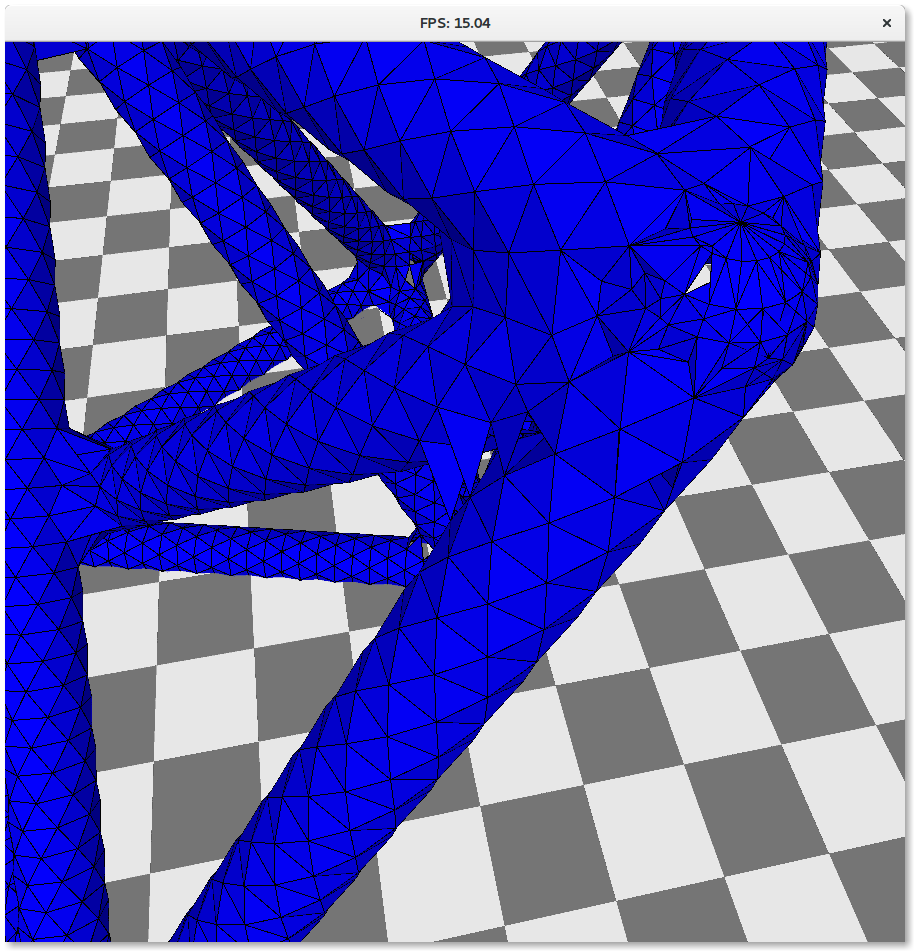</td>

_The holes can be cleaned up using a post processing step. Through the previous step, we have a list of all border edges. If we find a closed loop of border edges of size 3, we can assume it is an anomoly and fill the triangle up._ 

# References

1. [F. Bernardini, J. Mittleman, H. Rushmeier, C. Silva and G. Taubin, "The ball-pivoting algorithm for surface reconstruction," in IEEE Transactions on Visualization and Computer Graphics, vol. 5, no. 4, pp. 349-359, Oct.-Dec. 1999](http://ieeexplore.ieee.org/stamp/stamp.jsp?tp=&arnumber=817351&isnumber=17715)
2. [T. Lewiner, H. Lopes, J. Rossignac and A. W. Vieira, "Efficient Edgebreaker for surfaces of arbitrary topology," Proceedings. 17th Brazilian Symposium on Computer Graphics and Image Processing, 2004, pp. 218-225.](http://ieeexplore.ieee.org/stamp/stamp.jsp?tp=&arnumber=1352964&isnumber=29722)

